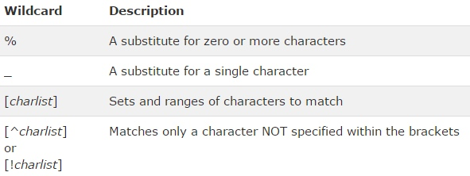
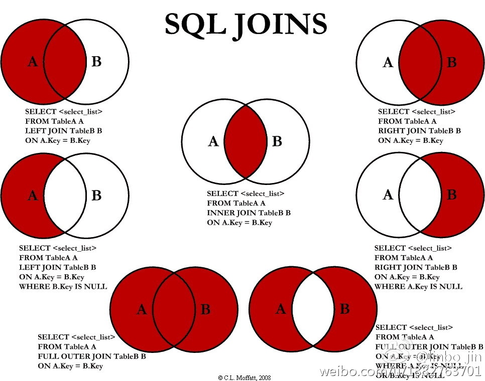

# SQL Note Commands
Table of Contents
=================

   * [SQL Note Commands](#sql-note-commands)
      * [SQL Basic](#sql-basic)
         * [SELECT](#select)
         * [INSERT INTO](#insert-into)
         * [UPDATE](#update)
         * [DELETE](#delete)
         * [SQL Injection](#sql-injection)
         * [SELECT TOP](#select-top)
         * [LIKE Operator](#like-operator)
         * [IN Operator](#in-operator)
         * [Between Operator](#between-operator)
         * [SQL Aliases](#sql-aliases)
      * [SQL Advanced](#sql-advanced)
         * [SQL Joins](#sql-joins)
         * [SQL UNION Operator](#sql-union-operator)
         * [SELECT INTO](#select-into)
         * [INSERT INTO SELECT](#insert-into-select)


## SQL Basic
[SQL](http://www.w3schools.com/sql/default.asp) stands for Structured Query Language<br>
RDBMS stands for Relational Database Management System: MySQL, PostgreSQL

Tables contain records (rows) with data. **One row is one record.**

**Some of The Most Important SQL Commands**

* SELECT - extracts data from a database
* UPDATE (SET) - updates data in a database
* DELETE - deletes data from a database
* INSERT INTO - inserts new data into a database
* CREATE DATABASE - creates a new database
* ALTER DATABASE - modifies a database
* CREATE TABLE - creates a new table
* ALTER TABLE - modifies a table
* DROP TABLE - deletes a table
* CREATE INDEX - creates an index (search key)
* DROP INDEX - deletes an index

### SELECT
```
SELECT column_name,column_name
FROM table_name;

SELECT * FROM table_name;

# return only distinct (different) values
SELECT DISTINCT column_name,column_name
FROM table_name;


# <> 
# BETWEEN (Between an inclusive range) 
# LIKE (Search for a pattern) LIKE 'a%'
SELECT column_name,column_name
FROM table_name
WHERE column_name operator value;


SELECT * FROM Customers
WHERE Country='Germany'
AND (City='Berlin' OR City='München');


#ORDER BY sort the result-set.
# in ascending order by default, DESC for in a descending order.
SELECT column_name, column_name
FROM table_name
ORDER BY column_name ASC|DESC, column_name ASC|DESC;

SELECT * FROM Customers
ORDER BY Country ASC, CustomerName DESC;
```


### INSERT INTO
```
INSERT INTO table_name
VALUES (value1,value2,value3,...);

INSERT INTO table_name (column1,column2,column3,...)
VALUES (value1,value2,value3,...);
```


### UPDATE
```
# care for where, if omitted, all the records will be updated
UPDATE table_name
SET column1=value1,column2=value2,...
WHERE some_column=some_value;

UPDATE Customers
SET ContactName='Alfred Schmidt', City='Hamburg'
WHERE CustomerName='Alfreds Futterkiste';
```

### DELETE
```
DELETE FROM table_name
WHERE some_column=some_value;

# Delete all data
DELETE FROM table_name;
or
DELETE * FROM table_name;
```

### SQL Injection
SQL injection is a technique where malicious users can inject SQL commands into an SQL statement, via web page input.
Injected SQL commands can alter SQL statement and compromise the security of a web application.
The only proven way to protect a web site from SQL injection attacks, is to use SQL parameters.
SQL parameters are values that are added to an SQL query at execution time, in a controlled manner.
by @number

```
txtNam = getRequestString("CustomerName");
txtAdd = getRequestString("Address");
txtCit = getRequestString("City");
txtSQL = "INSERT INTO Customers (CustomerName,Address,City) Values(@0,@1,@2)";
db.Execute(txtSQL,txtNam,txtAdd,txtCit);
```

###  SELECT TOP
```
# specify the number of records to return, very useful on large tables with thousands of records. 
# MS Sql
SELECT TOP number|percent column_name(s)
FROM table_name;

SELECT TOP 50 PERCENT * FROM Customers;

# MySql
SELECT column_name(s)
FROM table_name
LIMIT number;

SELECT *
FROM Persons
LIMIT 5;
```

### LIKE Operator
```
# used in a WHERE clause to search for a specified pattern in a column
SELECT column_name(s)
FROM table_name
WHERE column_name LIKE pattern;

# The "%" sign is used to define wildcards (missing letters) both before and after the pattern.
SELECT * FROM Customers
WHERE City LIKE 's%';

SELECT * FROM Customers
WHERE Country NOT LIKE '%land%';

#  starting with "b", "s", or "p":
SELECT * FROM Customers
WHERE City LIKE '[bsp]%';    
                '[a-c]%';
                '[!bsp]%'                                         
```



### IN Operator
```
# specify multiple values in a WHERE clause.
SELECT column_name(s)
FROM table_name
WHERE column_name IN (value1,value2,...);

SELECT * FROM Customers
WHERE City IN ('Paris','London');
```

### Between Operator
```
#  select values within a range, values can be numbers, text, or dates.
SELECT column_name(s)
FROM table_name
WHERE column_name BETWEEN value1 AND value2;

SELECT * FROM Products
WHERE Price NOT BETWEEN 10 AND 20;

SELECT * FROM Products
WHERE (Price BETWEEN 10 AND 20)
AND NOT CategoryID IN (1,2,3);

SELECT * FROM Orders
WHERE OrderDate BETWEEN #07/04/1996# AND #07/09/1996#;
```

### SQL Aliases
Give a database table, or a column in a table, a temporary name more readable. Aliases can be useful when:

* There are more than one table involved in a query
* Functions are used in the query
* Column names are big or not very readable
* Two or more columns are combined together

```
SELECT column_name AS alias_name
FROM table_name;

SELECT column_name(s)
FROM table_name AS alias_name;

SELECT CustomerName, CONCAT(Address,', ',City,', ',PostalCode,', ',Country) AS Address
FROM Customers;

SELECT o.OrderID, o.OrderDate, c.CustomerName
FROM Customers AS c, Orders AS o
WHERE c.CustomerName="Around the Horn" AND c.CustomerID=o.CustomerID;
```

## SQL Advanced
### SQL Joins
SQL joins are used to combine rows from two or more tables, based on a common field between them:

* INNER JOIN: Returns all rows when there is at least one match in BOTH tables
* LEFT JOIN: Return all rows from the left table, and the matched rows from the right table
* RIGHT JOIN: Return all rows from the right table, and the matched rows from the left table
* FULL JOIN: Return all rows when there is a match in ONE of the table

```
# INNER JOIN
SELECT column_name(s)
FROM table1
JOIN table2
ON table1.column_name=table2.column_name;

# LEFT JOIN
SELECT column_name(s)
FROM table1
LEFT JOIN table2
ON table1.column_name=table2.column_name;

# RIGHT JOIN
SELECT column_name(s)
FROM table1
RIGHT JOIN table2
ON table1.column_name=table2.column_name;

# FULL OUTER JOIN
SELECT column_name(s)
FROM table1
FULL OUTER JOIN table2
ON table1.column_name=table2.column_name;

# in MySql
SELECT * FROM t1
LEFT JOIN t2 ON t1.id = t2.id
UNION
SELECT * FROM t1
RIGHT JOIN t2 ON t1.id = t2.id
```




### SQL UNION Operator
The SQL UNION operator combines the result of two or more SELECT statements have the same number of columns. The columns must also have similar data types.

```
#  columns in each SELECT statement must be in the same order.
SELECT column_name(s) FROM table1
UNION
SELECT column_name(s) FROM table2;

# The UNION operator selects only distinct values by default. To allow duplicate values, use the ALL keyword with UNION.
SELECT column_name(s) FROM table1
UNION ALL
SELECT column_name(s) FROM table2;
```

### SELECT INTO
```
# copy all columns into the new table:
SELECT *
INTO newtable [IN externaldb]
FROM table1;

# copy only the columns we want into the new table
SELECT column_name(s)
INTO newtable [IN externaldb]
FROM table1;

SELECT *
INTO CustomersBackup2013 IN 'Backup.mdb'
FROM Customers;	

SELECT CustomerName, ContactName
INTO CustomersBackup2013
FROM Customers;

# Copy data from more than one table into the new table
SELECT Customers.CustomerName, Orders.OrderID
INTO CustomersOrderBackup2013
FROM Customers
LEFT JOIN Orders
ON Customers.CustomerID=Orders.CustomerID;
```

### INSERT INTO SELECT
```
# copy all columns from one table to another, existing table
INSERT INTO table2
SELECT * FROM table1;

# copy only the columns we want to into another, existing table:
INSERT INTO table2(column_name(s))
SELECT column_name(s)
FROM table1;

INSERT INTO Customers (CustomerName, Country)
SELECT SupplierName, Country FROM Suppliers;x
```


