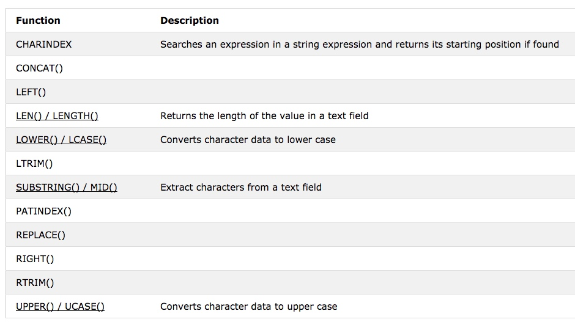
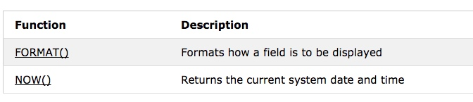

# SQL Note functions
Table of Contents
=================

 * [SQL Note functions](#sql-note-functions)
       * [GROUP BY](#group-by)
       * [HAVING](#having)

SQL has many built-in functions for performing calculations on data.

SQL Aggregate Functions:<br>


SQL String Functions:<br>


SQL Date and Time Data Types and Functions:<br>


### GROUP BY
```
SELECT column_name, aggregate_function(column_name)
FROM table_name
WHERE column_name operator value
GROUP BY column_name;

SELECT Shippers.ShipperName,COUNT(Orders.OrderID) AS NumberOfOrders FROM Orders
LEFT JOIN Shippers
ON Orders.ShipperID=Shippers.ShipperID
GROUP BY ShipperName;

SELECT Shippers.ShipperName, Employees.LastName,
COUNT(Orders.OrderID) AS NumberOfOrders
FROM ((Orders
INNER JOIN Shippers
ON Orders.ShipperID=Shippers.ShipperID)
INNER JOIN Employees
ON Orders.EmployeeID=Employees.EmployeeID)
GROUP BY ShipperName,LastName;
```

### HAVING
The HAVING clause was added to SQL because the WHERE keyword could not be used with aggregate functions.

```

SELECT column_name, aggregate_function(column_name)
FROM table_name
WHERE column_name operator value
GROUP BY column_name
HAVING aggregate_function(column_name) operator value;

# find  if any of the employees has registered more than 10 orders.
SELECT Employees.LastName, COUNT(Orders.OrderID) AS NumberOfOrders FROM (Orders
INNER JOIN Employees
ON Orders.EmployeeID=Employees.EmployeeID)
GROUP BY LastName
HAVING COUNT(Orders.OrderID) > 10;

#  find if the employees "Davolio" or "Fuller" have registered more than 25 orders.
SELECT Employees.LastName, COUNT(Orders.OrderID) AS NumberOfOrders FROM Orders
INNER JOIN Employees
ON Orders.EmployeeID=Employees.EmployeeID
WHERE LastName='Davolio' OR LastName='Fuller'
GROUP BY LastName
HAVING COUNT(Orders.OrderID) > 25;
```


