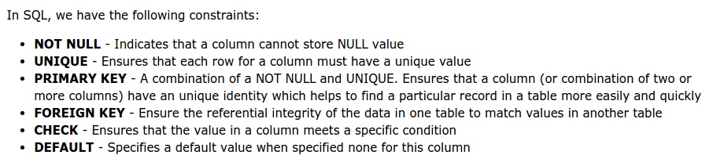

# SQL Note Schema
Table of Contents
=================

* [SQL Note Schema](#sql-note-schema)
 * [CREATE DATABASE](#create-database)
 * [CREATE TABLE](#create-table)
 * [SQL Constraints](#sql-constraints)
    * [NOT NULL](#not-null)
 * [UNIQUE](#unique)
    * [PRIMARY KEY](#primary-key)
    * [FOREIGN KEY](#foreign-key)
    * [CHECK Constraint](#check-constraint)
    * [DEFAULT](#default)
 * [CREATE INDEX](#create-index)
 * [DROP](#drop)
 * [ALTER](#alter)
 * [Auto-increment](#auto-increment)
 * [View](#view)
 * [SQL Comments](#sql-comments)

### CREATE DATABASE
```
CREATE DATABASE dbname;
```

### CREATE TABLE
```
CREATE TABLE table_name
(
  column_name1 data_type(size),
  column_name2 data_type(size),
  column_name3 data_type(size),
  ....
);

CREATE TABLE Persons
(
  PersonID int,
  LastName varchar(255),
  FirstName varchar(255),
  Address varchar(255),
  City varchar(255)
);
```

### SQL Constraints
[MySQL Data Types](http://www.w3schools.com/sql/sql_datatypes.asp)

SQL constraints are used to specify rules for the data in a table.
If there is any violation between the constraint and the data action, the action is aborted by the constraint.
Constraints can be specified when the table is created (inside the CREATE TABLE statement) or after the table is created (inside the ALTER TABLE statement).

```
CREATE TABLE table_name
(
  column_name1 data_type(size) constraint_name,
  column_name2 data_type(size) constraint_name,
  column_name3 data_type(size) constraint_name,
  ....
);
```



#### NOT NULL
```
# The NOT NULL constraint enforces a column to NOT accept NULL values.
CREATE TABLE PersonsNotNull
(
	P_Id int NOT NULL,
	LastName varchar(255) NOT NULL,
	FirstName varchar(255),
	Address varchar(255),
	City varchar(255)
)
```

### UNIQUE
The UNIQUE and PRIMARY KEY constraints both provide a guarantee for uniqueness for a column or set of columns.
A PRIMARY KEY constraint automatically has a UNIQUE constraint defined on it.
Note that you can have many UNIQUE constraints per table, but only one PRIMARY KEY constraint per table.

```
CREATE TABLE Persons
(
	P_Id int NOT NULL,
	LastName varchar(255) NOT NULL,
	FirstName varchar(255),
	Address varchar(255),
	City varchar(255),
	UNIQUE (P_Id)
)

# allow naming of a UNIQUE constraint, and for defining a UNIQUE constraint on multiple columns
CREATE TABLE Persons
(
	P_Id int NOT NULL,
	LastName varchar(255) NOT NULL,
	FirstName varchar(255),
	Address varchar(255),
	City varchar(255),
	CONSTRAINT uc_PersonID UNIQUE (P_Id,LastName)
)

# create a UNIQUE constraint on the "P_Id" column when the table is already created
ALTER TABLE Persons
ADD UNIQUE (P_Id)

ALTER TABLE Persons
ADD CONSTRAINT uc_PersonID UNIQUE (P_Id,LastName)


# drop a UNIQUE constraint
ALTER TABLE Persons
DROP INDEX uc_PersonID
```

#### PRIMARY KEY
Primary keys must contain UNIQUE values.
A primary key column cannot contain NULL values.
Most tables should have a primary key, and each table can have only ONE primary key.

```
CREATE TABLE Persons
(
	P_Id int NOT NULL,
	LastName varchar(255) NOT NULL,
	FirstName varchar(255),
	Address varchar(255),
	City varchar(255),
	PRIMARY KEY (P_Id)
)

# allow naming of a PRIMARY KEY constraint, and for defining a PRIMARY KEY constraint on multiple columns, 
CREATE TABLE Persons
(
	P_Id int NOT NULL,
	LastName varchar(255) NOT NULL,
	FirstName varchar(255),
	Address varchar(255),
	City varchar(255),
	CONSTRAINT pk_PersonID PRIMARY KEY (P_Id,LastName)
)

# create a PRIMARY KEY constraint on the "P_Id" column when the table is already created
ALTER TABLE Persons
ADD PRIMARY KEY (P_Id)

ALTER TABLE Persons
ADD CONSTRAINT pk_PersonID PRIMARY KEY (P_Id,LastName)

#  drop a PRIMARY KEY constraint
ALTER TABLE Persons
DROP PRIMARY KEY

ALTER TABLE Persons
DROP CONSTRAINT pk_PersonID
```

#### FOREIGN KEY
A FOREIGN KEY in one table points to a PRIMARY KEY in another table.
The FOREIGN KEY constraint is used to prevent actions that would destroy links between tables.
The FOREIGN KEY constraint also prevents invalid data from being inserted into the foreign key column, because it has to be one of the values contained in the table it points to.

```
CREATE TABLE Orders
(
	O_Id int NOT NULL,
	OrderNo int NOT NULL,
	P_Id int,
	PRIMARY KEY (O_Id),
	FOREIGN KEY (P_Id) REFERENCES Persons(P_Id)
)

# allow naming of a FOREIGN KEY constraint, and for defining a FOREIGN KEY constraint on multiple columns
CREATE TABLE Orders
(
	O_Id int NOT NULL,
	OrderNo int NOT NULL,
	P_Id int,
	PRIMARY KEY (O_Id),
	CONSTRAINT fk_PerOrders FOREIGN KEY (P_Id)
	REFERENCES Persons(P_Id)
)

# create a FOREIGN KEY constraint on the "P_Id" column when the "Orders" table is already created
ALTER TABLE Orders
ADD FOREIGN KEY (P_Id)
REFERENCES Persons(P_Id)

ALTER TABLE Orders
ADD CONSTRAINT fk_PerOrders
FOREIGN KEY (P_Id)
REFERENCES Persons(P_Id)

# drop a FOREIGN KEY constrain
ALTER TABLE Orders
DROP FOREIGN KEY fk_PerOrders
```

#### CHECK Constraint
The CHECK constraint is used to limit the value range that can be placed in a column.
If you define a CHECK constraint on a single column it allows only certain values for this column.
If you define a CHECK constraint on a table it can limit the values in certain columns based on values in other columns in the row.

```
CREATE TABLE Persons
(
	P_Id int NOT NULL,
	LastName varchar(255) NOT NULL,
	FirstName varchar(255),
	Address varchar(255),
	City varchar(255),
	CHECK (P_Id>0)
)

CREATE TABLE Persons
(
	P_Id int NOT NULL,
	LastName varchar(255) NOT NULL,
	FirstName varchar(255),
	Address varchar(255),
	City varchar(255),
	CONSTRAINT chk_Person CHECK (P_Id>0 AND City='Sandnes')
)

ALTER TABLE Persons
ADD CHECK (P_Id>0)

ALTER TABLE Persons
ADD CONSTRAINT chk_Person CHECK (P_Id>0 AND City='Sandnes')

ALTER TABLE Persons
DROP CONSTRAINT chk_Person

ALTER TABLE Persons
DROP CHECK chk_Person
```

#### DEFAULT
The DEFAULT constraint is used to insert a default value into a column.
The default value will be added to all new records, if no other value is specified.

```
CREATE TABLE Persons
(
	P_Id int NOT NULL,
	LastName varchar(255) NOT NULL,
	FirstName varchar(255),
	Address varchar(255),
	City varchar(255) DEFAULT 'Sandnes'
)

# The DEFAULT constraint can also be used to insert system values, by using functions like GETDATE():
CREATE TABLE Orders
(
	O_Id int NOT NULL,
	OrderNo int NOT NULL,
	P_Id int,
	OrderDate date DEFAULT GETDATE()
)

ALTER TABLE Persons
ALTER City SET DEFAULT 'SANDNES'

ALTER TABLE Persons
ALTER City DROP DEFAULT
```

### CREATE INDEX	
The CREATE INDEX statement is used to create indexes in tables.
Indexes allow the database application to find data fast; without reading the whole table.
An index can be created in a table to find data more quickly and efficiently.
The users cannot see the indexes, they are just used to speed up searches/queries.

```
CREATE INDEX index_name
ON table_name (column_name)

CREATE UNIQUE INDEX index_name
ON table_name (column_name)

CREATE INDEX PIndex
ON Persons (LastName)

CREATE INDEX PIndex
ON Persons (LastName, FirstName)
```

### DROP
```
ALTER TABLE table_name DROP INDEX index_name

DROP TABLE table_name

DROP DATABASE database_name

# What if we only want to delete the data inside the table, and not the table itself?
TRUNCATE TABLE table_name
```

### ALTER
```
ALTER TABLE table_name
ADD column_name datatype

ALTER TABLE table_name
DROP COLUMN column_name

ALTER TABLE Persons
ADD DateOfBirth date

ALTER TABLE Persons
ALTER COLUMN DateOfBirth year

ALTER TABLE Persons
DROP COLUMN DateOfBirth
```

### Auto-increment
```
CREATE TABLE Persons
(
	ID int NOT NULL AUTO_INCREMENT,
	LastName varchar(255) NOT NULL,
	FirstName varchar(255),
	Address varchar(255),
	City varchar(255),
	PRIMARY KEY (ID)
)

# let the AUTO_INCREMENT sequence start with another value
ALTER TABLE Persons AUTO_INCREMENT=100
```

### View
In SQL, a view is a virtual table based on the result-set of an SQL statement.
A view contains rows and columns, just like a real table. The fields in a view are fields from one or more real tables in the database.
You can add SQL functions, WHERE, and JOIN statements to a view and present the data as if the data were coming from one single table.

```
CREATE VIEW view_name AS
SELECT column_name(s)
FROM table_name
WHERE condition

# Note, a view always shows up-to-date data! The database engine recreates the data, using the view's SQL statement, every time a user queries a view.

# lists all active products (products that are not discontinued) from the "Products" table.
CREATE VIEW [Current Product List] AS
SELECT ProductID,ProductName
FROM Products
WHERE Discontinued=No

SELECT * FROM [Current Product List]

# selects every product in the "Products" table with a unit price higher than the average unit price
CREATE VIEW [Products Above Average Price] AS
SELECT ProductName,UnitPrice
FROM Products
WHERE UnitPrice>(SELECT AVG(UnitPrice) FROM Products)

SELECT * FROM [Products Above Average Price]

# update a view
CREATE OR REPLACE VIEW view_name AS
SELECT column_name(s)
FROM table_name
WHERE condition

# add the "Category" column to the "Current Product List" view
CREATE OR REPLACE VIEW [Current Product List] AS
SELECT ProductID,ProductName,Category
FROM Products
WHERE Discontinued=No

# delete a view 
DROP VIEW view_name
```

### SQL Comments
```
--Select all:
SELECT * FROM Customers;

SELECT * FROM Customers -- WHERE City='Berlin';

/*Select all the columns
of all the records
in the Customers table:*/
SELECT * FROM Customers;
```


